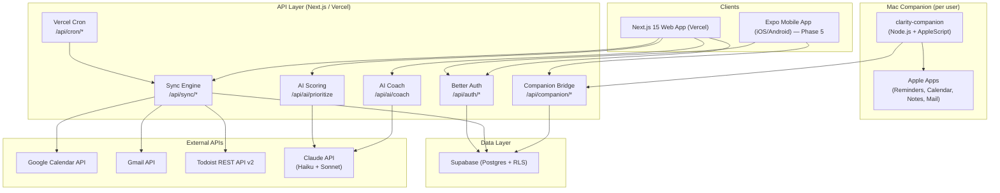
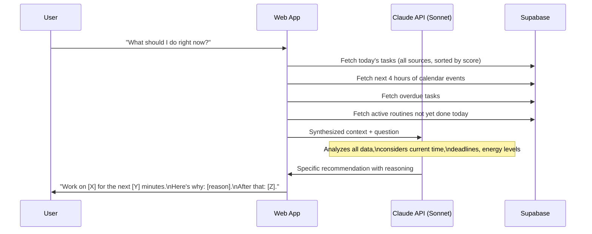

# Clarity — Architecture

## System Overview



## Core Data Models

### Task
```typescript
type TaskSource = 'todoist' | 'gmail' | 'manual' | 'apple_reminders' | 'routine'
type TaskStatus = 'pending' | 'in_progress' | 'completed' | 'cancelled'

interface Task {
  readonly id: string
  readonly userId: string
  readonly source: TaskSource
  readonly externalId: string | null
  readonly title: string
  readonly description: string | null
  readonly status: TaskStatus
  readonly dueDate: string | null          // ISO date
  readonly dueTime: string | null          // HH:mm
  readonly priorityScore: number | null    // 0-100 (AI computed)
  readonly priorityManual: number | null   // 1-5 (user override)
  readonly labels: readonly string[]
  readonly isCompleted: boolean
  readonly completedAt: string | null
  readonly externalUrl: string | null
  readonly metadata: Record<string, unknown>
  readonly createdAt: string
  readonly updatedAt: string
}
```

### CalendarEvent
```typescript
type EventSource = 'google_calendar' | 'apple_calendar'

interface CalendarEvent {
  readonly id: string
  readonly userId: string
  readonly source: EventSource
  readonly externalId: string | null
  readonly title: string
  readonly description: string | null
  readonly startTime: string    // ISO 8601 with timezone
  readonly endTime: string
  readonly isAllDay: boolean
  readonly location: string | null
  readonly calendarName: string | null
  readonly color: string | null
  readonly metadata: Record<string, unknown>
  readonly createdAt: string
  readonly updatedAt: string
}
```

### Routine
```typescript
type RoutineFrequency = 'daily' | 'weekdays' | 'weekends' | 'weekly' | 'custom'

interface Routine {
  readonly id: string
  readonly userId: string
  readonly title: string
  readonly frequency: RoutineFrequency
  readonly customDays: readonly number[] | null  // 0=Sun, 6=Sat
  readonly preferredTime: string                 // HH:mm
  readonly durationMinutes: number
  readonly isActive: boolean
  readonly streakCurrent: number
  readonly streakBest: number
  readonly sharedWith: readonly string[]
  readonly createdAt: string
  readonly updatedAt: string
}
```

## Apple Integration Architecture

### The Problem
Apple provides no web APIs for Reminders, Notes, or Mail. Apple Calendar is accessible via CalDAV but AppleScript is more reliable for personal use.

### Solution: Mac Companion Process

```
clarity-companion/
  index.ts           # Main process (HTTP server on localhost:3741)
  scripts/
    reminders.applescript
    calendar.applescript
    notes.applescript
    mail.applescript
  sync.ts            # Reads Apple apps, pushes to Supabase
  auth.ts            # Session auth with Vercel web app
```

The companion:
1. Runs as a background process on each Mac (launchd plist or menubar app)
2. Uses AppleScript to read Apple Reminders, Calendar, Notes, Mail
3. Pushes data to Supabase directly on a schedule (every 5 minutes)
4. Also writes back: creates Apple Reminders from high-priority tasks flagged by AI

### AppleScript Capabilities (via apple-mcp patterns)
- **Reminders**: Read all lists + items, create reminders with due dates, mark complete
- **Calendar**: Read events from all calendars, create events
- **Notes**: Read note titles + content, create notes
- **Mail**: Read flagged/unread emails from important folders

## AI Coach Architecture

The "What should I do right now?" feature:



### Context sent to Claude
- Current time + day
- Today's tasks with sources, priorities, due times
- Next 4 hours of calendar events
- Overdue tasks
- Routines scheduled for today (done/not done)
- User's work hours preference
- Recent completions (last 2 hours)

### Prompt structure
```typescript
const COACH_SYSTEM_PROMPT = `
You are Clarity's personal productivity coach.
You have complete visibility into the user's tasks, events, and context.
Your job is to give ONE specific, actionable recommendation when asked "What should I do right now?"

Rules:
- Be direct. Pick ONE thing to work on.
- State the reason in one sentence.
- Mention the next thing after.
- If it's a good time for a routine that hasn't been done, suggest it.
- Never give a list of options. Make the decision for them.
- Keep the answer under 100 words.
`
```

## Sync Architecture

### Pull sync (Vercel Cron, every 5 min)
1. Google Calendar: REST API with incremental sync (syncToken)
2. Todoist: REST API v2 (poll with since parameter)
3. Gmail: REST API (flagged/important messages)

### Push sync (Mac Companion, every 5 min)
1. Apple Reminders -> tasks table (source = 'apple_reminders')
2. Apple Calendar -> events table (source = 'apple_calendar')
3. Apple Notes -> notes table (read-only summaries)
4. Write-back: high-priority tasks -> Apple Reminders (if not already there)

### Conflict resolution
- External source always wins for externally-managed fields
- User overrides (priority_manual, labels) always preserved
- Dedup on (user_id, source, source_id)

## Database Schema (Key Tables)

```sql
-- Unified tasks
create table tasks (
  id uuid primary key default gen_random_uuid(),
  user_id uuid not null references auth.users(id) on delete cascade,
  source text not null,         -- todoist, apple_reminders, manual, gmail, routine
  source_id text,               -- external ID for dedup
  title text not null,
  description text,
  due_date date,
  due_time time,
  priority_score int,           -- AI computed 0-100
  priority_manual int,          -- user override 1-5
  is_completed boolean not null default false,
  completed_at timestamptz,
  labels text[] not null default '{}',
  metadata jsonb not null default '{}',
  created_at timestamptz not null default now(),
  updated_at timestamptz not null default now(),
  unique (user_id, source, source_id)
);

-- Unified events
create table events (
  id uuid primary key default gen_random_uuid(),
  user_id uuid not null references auth.users(id) on delete cascade,
  source text not null,         -- google_calendar, apple_calendar
  source_id text,
  title text not null,
  start_at timestamptz not null,
  end_at timestamptz not null,
  is_all_day boolean not null default false,
  calendar_name text,
  location text,
  metadata jsonb not null default '{}',
  created_at timestamptz not null default now(),
  updated_at timestamptz not null default now(),
  unique (user_id, source, source_id)
);

-- Routines
create table routines (
  id uuid primary key default gen_random_uuid(),
  user_id uuid not null references auth.users(id) on delete cascade,
  title text not null,
  frequency text not null,      -- daily, weekdays, weekends, weekly, custom
  custom_days int[],            -- 0=Sun..6=Sat
  preferred_time time,
  duration_minutes int not null default 30,
  is_active boolean not null default true,
  streak_current int not null default 0,
  streak_best int not null default 0,
  created_at timestamptz not null default now(),
  updated_at timestamptz not null default now()
);

-- Routine completions
create table routine_completions (
  id uuid primary key default gen_random_uuid(),
  routine_id uuid not null references routines(id) on delete cascade,
  user_id uuid not null references auth.users(id) on delete cascade,
  completed_date date not null,
  completed_at timestamptz not null default now(),
  unique (routine_id, completed_date)
);

-- Connected integrations
create table integrations (
  id uuid primary key default gen_random_uuid(),
  user_id uuid not null references auth.users(id) on delete cascade,
  provider text not null,       -- google, todoist, apple_companion
  access_token_encrypted text,
  refresh_token_encrypted text,
  token_expires_at timestamptz,
  provider_account_id text,
  config jsonb not null default '{}',
  sync_status text not null default 'idle',
  last_synced_at timestamptz,
  last_error text,
  unique (user_id, provider)
);
```

## Security

- **Token encryption**: pgcrypto symmetric encryption for OAuth tokens
- **RLS**: Row-level security on all tables — users only see their own data
- **Companion auth**: Uses Better Auth session token to authenticate pushes
- **Apple credentials**: Never stored in database — only on user's local Mac
- **Service role key**: Server-side only, never in client bundle

## Key Architectural Decisions

| Decision | Choice | Rationale |
|----------|--------|-----------|
| Apple integration | Mac companion (AppleScript) | No public web APIs for Reminders/Notes; AppleScript gives full read/write |
| AI coach model | Claude Sonnet | Needs nuanced reasoning for "what now?" recommendations |
| AI scoring model | Claude Haiku | Batch priority scoring is high-volume, cost-sensitive |
| Auth | Better Auth | Self-hosted, no per-MAU cost, handles Google OAuth with calendar/gmail scopes |
| DB | Supabase | RLS for multi-user, real-time subscriptions, built-in for auth |
| Sync | Vercel Cron + companion | Zero ops, free on Pro; companion handles Apple-side |
