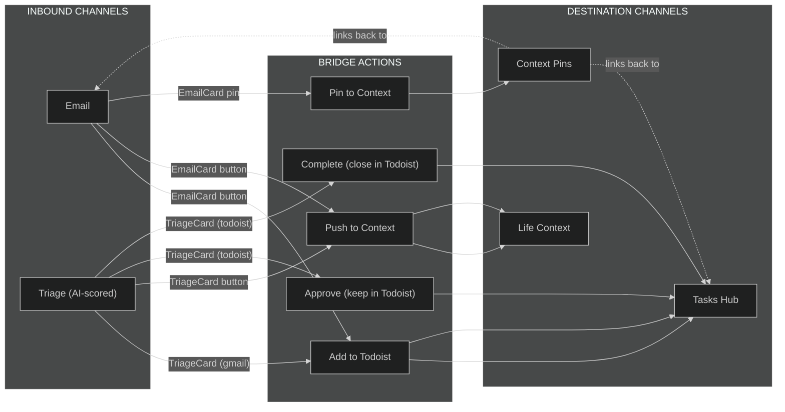

# Clarity Card & Data Architecture

Reference for designing cards in Pencil and understanding cross-channel data flows.

## Data Flow Overview

```mermaid
%%{init: {'theme': 'dark', 'themeVariables': {'fontSize': '14px'}}}%%

graph TB
    subgraph Sources["DATA SOURCES"]
        TODOIST["Todoist API"]
        GMAIL["Gmail API"]
        GCAL["Google Calendar API"]
        PLAID["Plaid API"]
        MANUAL["Manual Input"]
        ROUTINES_SRC["Routine Definitions"]
        AI_PROVIDERS["AI Providers<br/>(Anthropic/DeepSeek/Groq/Gemini)"]
    end

    subgraph DB["DATABASE (Turso)"]
        tasks["tasks"]
        events["events"]
        emails["emails"]
        triage_queue["triage_queue"]
        life_context["life_context_items"]
        context_pins["context_pins"]
        routines["routines + completions"]
        financial["financial_snapshot"]
        transactions["transactions"]
        plaid_items["plaid_items + accounts"]
        coach_msgs["coach_messages"]
        day_plans["day_plans"]
    end

    subgraph Cards["CARD COMPONENTS"]
        direction TB

        subgraph Dashboard["TODAY PAGE"]
            DC_TASK["TaskCard<br/>dashboard/task-card.tsx"]
            DC_EVENT["EventCard<br/>dashboard/event-card.tsx"]
            DC_TIME["TimeCard<br/>dashboard/day-plan/time-card.tsx"]
            DC_HORIZON["HorizonCards<br/>dashboard/day-plan/horizon-cards.tsx"]
        end

        subgraph TaskHub["TASKS HUB"]
            TC_ENHANCED["TaskCardEnhanced<br/>tasks/task-card-enhanced.tsx"]
            TC_TABLE["TaskTable<br/>tasks/task-table.tsx"]
        end

        subgraph TriagePage["TRIAGE"]
            TR_CARD["TriageCard<br/>triage/triage-card.tsx"]
            TR_TABLE["TriageTable<br/>triage/triage-table.tsx"]
        end

        subgraph EmailPage["EMAIL"]
            EM_CARD["EmailCard<br/>email/email-card.tsx"]
            EM_TABLE["EmailTable<br/>email/email-table.tsx"]
        end

        subgraph Finance["SPENDING"]
            FN_SNAPSHOT["FinancialSnapshotCard<br/>life-context/financial-snapshot-card.tsx"]
        end

        subgraph CrossCutting["CROSS-CUTTING"]
            PIN_DIALOG["PinToContextDialog<br/>life-context/pin-to-context-dialog.tsx"]
        end
    end

    %% Source -> DB flows
    TODOIST -->|sync every 15min| tasks
    GMAIL -->|sync every 15min| emails
    GCAL -->|sync every 15min| events
    PLAID -->|Link + sync| transactions
    PLAID --> plaid_items
    MANUAL --> tasks
    MANUAL --> life_context
    ROUTINES_SRC --> routines
    AI_PROVIDERS -->|score| triage_queue
    AI_PROVIDERS -->|generate| day_plans

    %% DB -> Card flows
    tasks --> DC_TASK
    tasks --> TC_ENHANCED
    tasks --> TC_TABLE
    events --> DC_EVENT
    day_plans --> DC_TIME
    day_plans --> DC_HORIZON
    triage_queue --> TR_CARD
    triage_queue --> TR_TABLE
    emails --> EM_CARD
    emails --> EM_TABLE
    financial --> FN_SNAPSHOT
    transactions --> FN_SNAPSHOT
    life_context --> PIN_DIALOG

    %% Cross-cutting pin connections
    DC_EVENT -.->|"pin to context"| PIN_DIALOG
    TC_ENHANCED -.->|"pin to context"| PIN_DIALOG
    EM_CARD -.->|"pin to context"| PIN_DIALOG
    PIN_DIALOG -->|creates| context_pins

    classDef source fill:#1e3a5f,stroke:#4a90d9,color:#fff
    classDef db fill:#2d1f3d,stroke:#8b5cf6,color:#fff
    classDef card fill:#1c2128,stroke:#d4a017,color:#fff
    classDef cross fill:#2d2118,stroke:#d4a017,color:#d4a017

    class TODOIST,GMAIL,GCAL,PLAID,MANUAL,ROUTINES_SRC,AI_PROVIDERS source
    class tasks,events,emails,triage_queue,life_context,context_pins,routines,financial,transactions,plaid_items,coach_msgs,day_plans db
    class DC_TASK,DC_EVENT,DC_TIME,DC_HORIZON,TC_ENHANCED,TC_TABLE,TR_CARD,TR_TABLE,EM_CARD,EM_TABLE,FN_SNAPSHOT card
    class PIN_DIALOG cross
```

## Card Actions Matrix

| Card | Source Data | Actions Available |
|------|-----------|-------------------|
| **Dashboard TaskCard** | `tasks` | Complete, Open in Todoist (external link) |
| **Dashboard EventCard** | `events` | Pin to Context |
| **Dashboard TimeCard** | `day_plans` (AI) | Collapse/expand, links to source pages (tasks/calendar/routines/email) |
| **Dashboard HorizonCards** | `day_plans` (AI) | Display only (3-day lookahead) |
| **TaskCardEnhanced** | `tasks` | Complete, Hide, Reschedule, Pin to Context, Expand subtasks |
| **TaskTable** | `tasks` | Complete, Hide, Bulk select, Sort columns |
| **TriageCard** | `triage_queue` | **Todoist items:** Complete, Approve (with priority picker P1-P4), Push to Context, Dismiss |
| | | **Gmail items:** Add to Todoist, Push to Context, Dismiss |
| **TriageTable** | `triage_queue` | Same as TriageCard in table layout |
| **EmailCard** | `emails` | Add to Todoist, Push to Context, Archive, Favorite/Star, Read body (expand), Pin to Context |
| **EmailTable** | `emails` | Same as EmailCard in table layout |
| **FinancialSnapshotCard** | `financial_snapshot` | Edit balance, Edit burn, Edit notes, Save, Runway calc |

## Cross-Channel Flows (Combo Paths)

These are the key data bridges where one channel's card can push data into another:

### Key Combo Patterns

1. **Email -> Todoist**: `EmailCard` "Todoist" button calls `/api/emails/actions` with `add_to_todoist` -> creates task in Todoist -> syncs back to `tasks` table
2. **Email -> Life Context**: `EmailCard` "Context" button calls `/api/emails/actions` with `push_to_context` -> creates `life_context_items` entry
3. **Triage (Gmail) -> Todoist**: `TriageCard` "Add to Todoist" opens approve modal -> creates Todoist task
4. **Triage (Todoist) -> Priority Change**: `TriageCard` P1-P4 picker + "Approve" -> updates priority in Todoist API
5. **Any Card -> Context Pin**: `PinToContextDialog` (used by TaskCardEnhanced, EventCard, EmailCard) -> creates `context_pins` row linking any item to a `life_context_items` entry
6. **AI Day Plan -> Source Links**: `TimeCard` source badges link back to `/tasks`, `/calendar`, `/routines`, `/email` based on `item.source`

## File Index

### Cards

| File | Component | Area |
|------|-----------|------|
| `src/components/dashboard/task-card.tsx` | TaskCard | Today page |
| `src/components/dashboard/event-card.tsx` | EventCard | Today page |
| `src/components/dashboard/day-plan/time-card.tsx` | TimeCard | Today page |
| `src/components/dashboard/day-plan/horizon-cards.tsx` | HorizonCards | Today page |
| `src/components/tasks/task-card-enhanced.tsx` | TaskCardEnhanced | Tasks hub |
| `src/components/tasks/task-table.tsx` | TaskTable | Tasks hub |
| `src/components/triage/triage-card.tsx` | TriageCard | Triage |
| `src/components/triage/triage-table.tsx` | TriageTable | Triage |
| `src/components/email/email-card.tsx` | EmailCard | Email |
| `src/components/email/email-table.tsx` | EmailTable | Email |
| `src/components/life-context/financial-snapshot-card.tsx` | FinancialSnapshotCard | Spending |

### Cross-Cutting

| File | Component | Used By |
|------|-----------|---------|
| `src/components/life-context/pin-to-context-dialog.tsx` | PinToContextDialog | TaskCardEnhanced, EventCard, EmailCard |
| `src/components/ui/card.tsx` | Card (shadcn primitive) | All cards |
| `src/components/ui/table.tsx` | Table (shadcn primitive) | All tables |

### Data Sources

| File | Purpose |
|------|---------|
| `src/types/task.ts` | Task types, sources (todoist/gmail/manual/apple_*/calendar/routine), priority helpers |
| `src/lib/schema.ts` | 23 Drizzle tables |
| `src/lib/ai/plan-parser.ts` | Day plan parsing (TimeBlock, PlanItem, HorizonDay) |

### Design

| File | Purpose |
|------|---------|
| `.interface-design/system.md` | Design system tokens and principles |
| `src/app/globals.css` | CSS variables and utilities |
| `src/components/dev/card-playground.tsx` | Card style playground |
